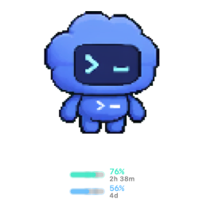
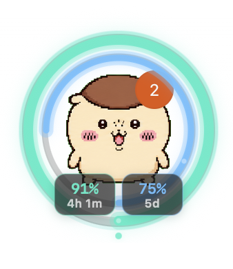
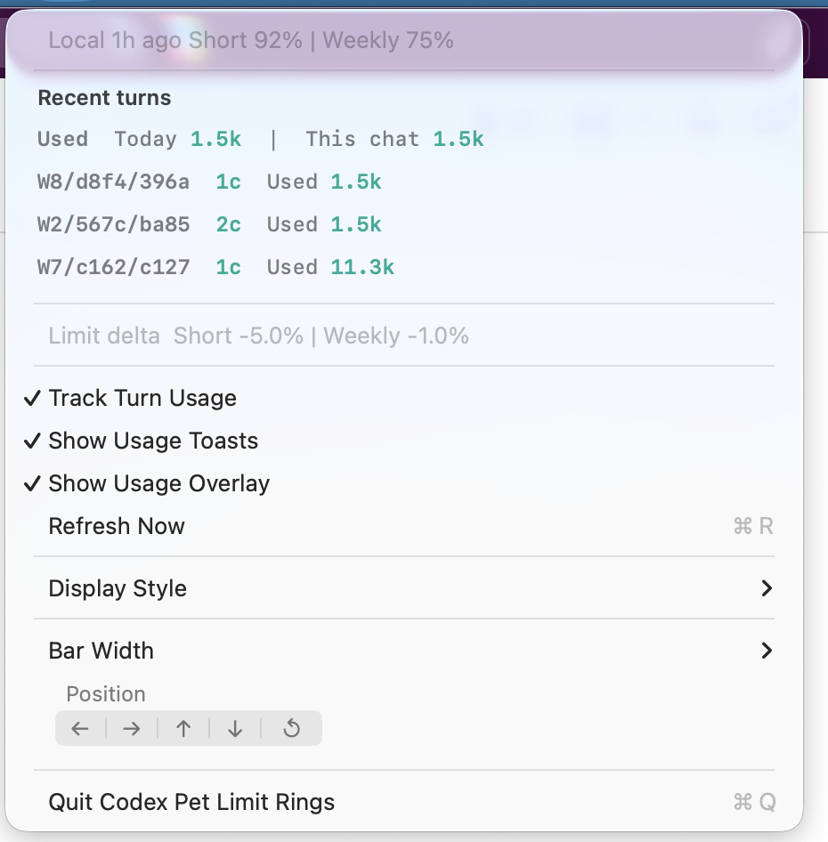

# codex-pet-limit-rings

Codex 펫 주변에 사용량 한도를 링이나 바로 표시하는 macOS 보조 앱입니다. Codex 앱 번들을 수정하지 않고, 로컬 Codex 상태와 사용량 로그만 읽어 별도 투명 오버레이 창을 그립니다.

앱은 펫 이미지를 교체하지 않습니다. Codex가 현재 띄운 펫을 그대로 쓰고, 그 주변에 사용량 표시만 얹습니다.



위 이미지는 실제 실행 화면 예시입니다. 펫은 Codex가 띄운 현재 펫이고, 아래 두 줄만 이 앱이 그리는 바 스타일 오버레이입니다.

## 빠른 설치

저장소를 로컬에 받은 뒤 실행합니다. `git clone`이 가장 편하지만, GitHub ZIP을 받아도 됩니다.

```bash
tools/install-limit-rings.sh
```

개발 모드로 한 번만 실행:

```bash
tools/run-limit-rings.sh
```

제거:

```bash
tools/uninstall-limit-rings.sh
tools/uninstall-turn-usage-hook.sh
```

## Codex에게 맡기기

이 저장소는 Codex 에이전트가 바로 설치할 수 있게 구성되어 있습니다. Codex에게 이렇게 요청하면 됩니다.

```text
Use the bundled codex-pet-limit-rings skill from this repository. Install the usage-overlay companion for my Codex pet, verify the LaunchAgent is running, and confirm the overlay stays anchored to the pet.
```

관련 파일:

- [AGENTS.md](AGENTS.md): 프로젝트 작업 규칙
- [skills/codex-pet-limit-rings/SKILL.md](skills/codex-pet-limit-rings/SKILL.md): 설치/검증 워크플로
- [docs/limit-rings.md](docs/limit-rings.md): 데이터와 렌더링 모델
- [docs/recent-usage.md](docs/recent-usage.md): 턴 사용량 표시 의미

스킬을 로컬 Codex에 설치하려면:

```bash
tools/install-codex-skill.sh
```

## 이미지로 보는 UI

아래 이미지는 실제 실행 화면 예시입니다. 퍼센트와 리셋 시간은 사용자의 로컬 Codex 로그에 따라 바뀝니다.

### 링



새 설치의 기본 표시입니다. 가운데에는 현재 Codex 펫이 보이고, 바깥 링은 짧은 사용량 창, 안쪽 링은 주간 한도의 남은 비율을 보여 줍니다.

### 바


더 작게 보고 싶을 때 쓰는 표시입니다. 위쪽 바는 짧은 사용량 창, 아래쪽 바는 주간 한도입니다. `Display Style`을 `Bars`로 바꾸면 폭과 위치를 메뉴에서 조정할 수 있습니다.

### 메뉴



메뉴 막대 아이콘에서 오버레이 표시, 링/바 전환, 바 위치, 새로고침, 종료를 제어합니다. `Track Turn Usage`를 켜면 `Recent turns`, `Used Today`, `This chat`, `Limit delta`가 함께 표시됩니다.

`Track Turn Usage`와 `Show Usage Toasts`를 켜면 새 턴 사용량이 관측될 때 짧은 토스트가 뜹니다. `Used`는 `max(0, In - Cached) + Out`으로 계산한 goal 스타일 토큰 값입니다.

## 동작 방식

앱은 세 파일/상태를 중심으로 동작합니다.

- `~/.codex/.codex-global-state.json`: 펫 표시 여부와 위치
- `~/.codex/logs_2.sqlite`: 최신 로컬 `codex.rate_limits` 이벤트와 response `usage`
- `~/.codex/codex-pet-limit-rings/*`: 선택 hook의 설정과 작은 로컬 카운터

펫을 닫으면 오버레이도 사라지고, 다시 켜면 따라옵니다. 여러 모니터에서도 현재 펫 위치를 기준으로 움직입니다.

## Track Turn Usage

최근 Codex 턴의 로컬 토큰 사용량을 메뉴와 토스트에 보여 주는 선택 기능입니다. 더 정확한 종료 시점 기록이 필요하면 `Stop` hook을 설치합니다.

```bash
tools/install-turn-usage-hook.sh
```

표시 값:

- `Used`: `max(0, In - Cached) + Out`
- `Used Today`: 오늘 사용 토큰
- `Session`: 최신 세션 사용 토큰
- `I`, `Ca`, `O`: input, cached input, output tokens
- `2c`, `3c`: 같은 턴 그룹에서 관측된 response usage 호출 수

이 값은 로컬 활동을 이해하기 위한 보조 정보이며 과금 계산기나 공식 rate-limit 산식이 아닙니다. 자세한 내용은 [docs/recent-usage.md](docs/recent-usage.md)를 참고하세요.

## 프라이버시

앱은 로컬 파일만 읽고, OpenAI API 키나 `~/.codex/auth.json`을 읽지 않습니다. 원격 사용량 엔드포인트도 호출하지 않습니다.

전역 마우스 이벤트 모니터링을 끄려면:

```bash
CODEX_PET_LIMIT_RINGS_NO_MOUSE_MONITOR=1 tools/install-limit-rings.sh
```

## 프로젝트 구조

```text
tools/
  codex-pet-limit-rings.swift      macOS 보조 앱
  install-limit-rings.sh           빌드/설치/로그인 항목 시작
  uninstall-limit-rings.sh         앱과 로그인 항목 제거
  install-turn-usage-hook.sh       선택 Stop hook 설치
  run-limit-rings.sh               개발 실행

skills/codex-pet-limit-rings/
  SKILL.md                         Codex 에이전트용 작업 흐름

docs/
  assets/                          README 이미지
  limit-rings.md                   구현 계약
  recent-usage.md                  턴 사용량 표시 의미
```

## 개발

```bash
tools/build-limit-rings.sh
swiftc tools/codex-pet-limit-rings.swift -o tmp/codex-pet-limit-rings -framework AppKit -lsqlite3
tmp/codex-pet-limit-rings --preview tmp/limit-rings-preview.png --size 164
bash -n tools/*.sh
tools/test-limit-rings-usage.sh
```

## 라이선스

MIT. 자세한 내용은 [LICENSE](LICENSE)를 참고하세요.
