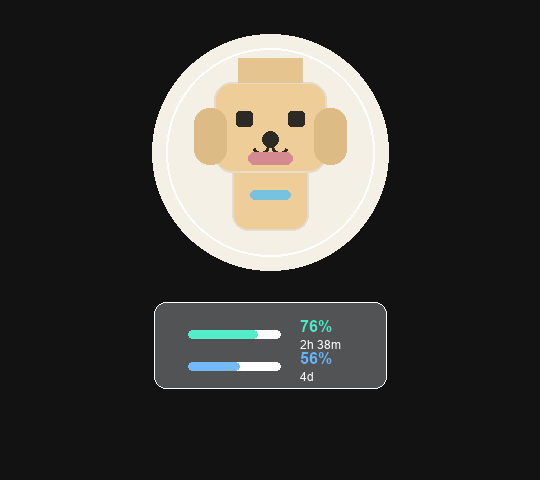

# codex-pet-limit-rings

Codex pets are tiny ambient companions for the work happening in Codex. This project adds one more layer to that idea: your pet can quietly show how much Codex capacity you have left, without turning the app into a dashboard.

The experience is a small macOS companion app. It watches where the Codex pet is, draws two polished rings around it, and keeps those rings attached to the pet as it moves. It does not patch Codex, change pet art, or modify the Codex app bundle.

It works with whatever Codex pet you like. Built-in pet, custom pet, tiny dog, robot, weather daemon, or anything else: the app does not care. It only follows the pet window that Codex is already showing.



## What You See

The rings are designed to be glanceable:

- The outer ring shows the short-window limit remaining.
- The inner ring shows the weekly limit remaining.
- Color moves from calm green/blue to amber and red as capacity gets low.
- Hovering over the pet or rings shows the exact percentages at the current ring endpoints when mouse monitoring is enabled.
- A small menu-bar icon lets you hide the rings, refresh data, or quit.

When the Codex pet is closed, the rings disappear. When the pet comes back, they come back too. On multi-display setups, the rings stay with the pet instead of jumping to whichever screen is focused.

Because the rings are drawn in a separate transparent overlay, they do not need pet-specific sprites, masks, metadata, or configuration. Change pets in Codex and the rings follow the new one automatically.

## Why It Works This Way

The important design choice is the companion boundary. A menu item inside Codex itself would mean patching Electron app files and redoing that patch after app updates. That is brittle and hard to open source.

`codex-pet-limit-rings` stays outside the Codex app. It reads local Codex state and the latest local `codex.rate_limits` event, then renders its own transparent always-on-top window around the pet. The result is reversible, inspectable, and easy for another Codex agent to install or modify.

Pet wakeups are handled by a lightweight filesystem watcher on Codex's local global-state file, with a slow fallback timer as a safety net. That lets the rings snap back when the pet is re-enabled without constantly polling for position changes.

## Quick Start

Install the rings as a login item:

```bash
tools/install-limit-rings.sh
```

You should see a small rings icon in the macOS menu bar. Use that menu to toggle `Show Rings`, refresh the latest usage data, or quit. The usage summary includes how old the local rate-limit log entry is.

Then use any Codex pet normally. No pet setup step is required.

Run a development build without installing the login item:

```bash
tools/run-limit-rings.sh
```

Uninstall everything the installer adds:

```bash
tools/uninstall-limit-rings.sh
```

## Give This Repo To Codex

This repository is structured so a Codex agent can pick it up from a GitHub link.

Ask the agent:

```text
Use the bundled codex-pet-limit-rings skill from this repository. Install the rings companion for my Codex pet, verify the LaunchAgent is running, and confirm the rings stay anchored to the pet.
```

The agent should read:

- `AGENTS.md` for the project contract.
- `skills/codex-pet-limit-rings/SKILL.md` for the install, debug, and validation workflow.
- `docs/limit-rings.md` for the data and rendering model.

To install the bundled skill into local Codex:

```bash
tools/install-codex-skill.sh
```

## Data And Privacy

The app reads only local Codex files:

- `~/.codex/.codex-global-state.json` tells it whether the pet is open and where it is.
- `~/.codex/logs_2.sqlite` provides the latest local websocket `codex.rate_limits` event.

It does not require an OpenAI API key, does not read `~/.codex/auth.json`, and does not call a remote usage endpoint. It does not send pet images, screenshots, prompts, or repo contents anywhere.

For stricter local privacy, run the binary with `--no-mouse-monitor` to disable global mouse event monitoring. The rings still follow Codex's persisted pet state, but drag-follow and hover readouts are disabled.
Set `CODEX_PET_LIMIT_RINGS_NO_MOUSE_MONITOR=1` when running `tools/run-limit-rings.sh` or `tools/install-limit-rings.sh` to apply the same mode through the helper scripts.

## Project Shape

```text
tools/
  codex-pet-limit-rings.swift      native macOS companion app
  install-limit-rings.sh           build, install, and start at login
  uninstall-limit-rings.sh         remove the app and login item
  run-limit-rings.sh               development launch
  build-limit-rings.sh             app bundle builder
  install-codex-skill.sh           copy the bundled skill into ~/.codex/skills

skills/codex-pet-limit-rings/
  SKILL.md                         Codex-agent workflow for this project

docs/
  limit-rings.md                   implementation contract and data flow

experiments/weather-pets/
  earlier weather-pet renderer     kept as a separate experiment
```

## Development

Build the app:

```bash
tools/build-limit-rings.sh
```

Render a static preview PNG:

```bash
swiftc tools/codex-pet-limit-rings.swift -o tmp/codex-pet-limit-rings -framework AppKit -lsqlite3
tmp/codex-pet-limit-rings --preview tmp/limit-rings-preview.png --size 164
```

Validate the shell scripts:

```bash
bash -n tools/*.sh
```

## Experiments

The original exploration included a Python renderer for weather-mutated Codex pets. That work now lives under `experiments/weather-pets/` so the public repo can stay focused on limit rings while preserving the larger idea: Codex pets can become ambient interfaces for state, context, and mood.

## License

MIT. See `LICENSE`.
